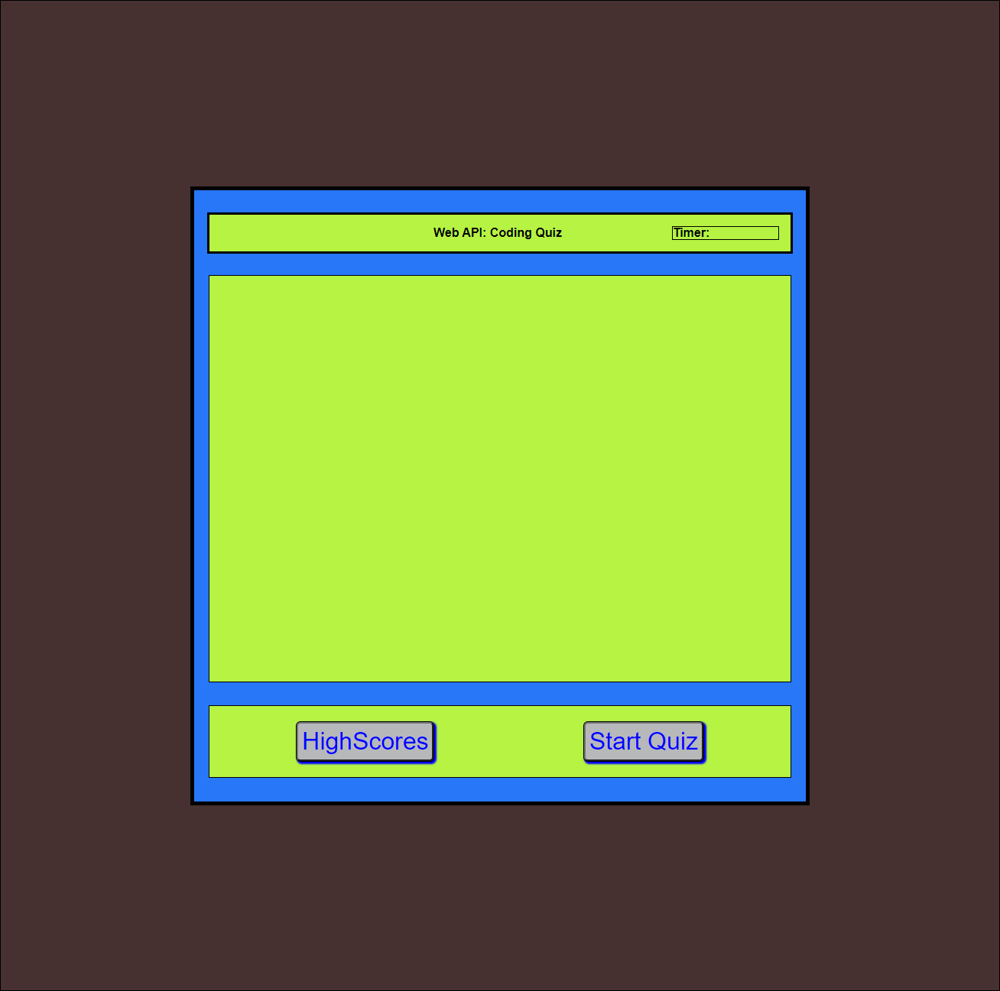

# web-api-code-quiz

## Objectives

The purpose of this assignment was to create a program in javascript will generate a quiz linked to a timer. After the quiz is finished or the timer runs out the score will be tracked of the user. The user will then be able to input their initials and save their high score. This project was intended to teach the different uses of functions in javascript, how they can interact with arrays, and implement them into a code that will accomplish a specific task.

## Screenshot of Final Page

## Link to the Final Page and GitHub

[Here is a link to my final page](https://jandrewanderson.github.io/web-api-code-quiz/)

[Here is the link to my Github Repository](https://github.com/jandrewanderson/web-api-code-quiz)

### Contributions

Joseph Andrew Anderson

### Resources

https://www.w3schools.com/html/html5_semantic_elements.asp
https://www.pluralsight.com/guides/semantic-html
https://stackoverflow.com

I also received some help from a number of members from my class as well as my instructor. Each of them helped me by helping me understand the way that javascript elements work and would give me hints of things to research. 

### License

This code is licensed under the MIT License.